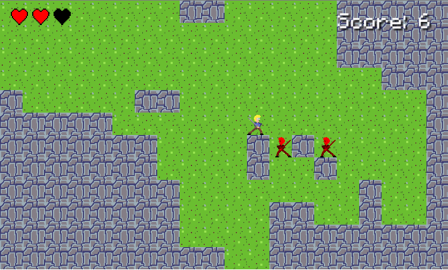

#Rogue Slasher (#onegameaweek - Game 2)

Simple hacknslash rogue-like.  Based on the textbased rogue-like tutorial from [How to Make Your First RogueLike](http://gamedevelopment.tutsplus.com/tutorials/how-to-make-your-first-roguelike--gamedev-13677) 

You can play the game [here](http://divideby5.com/games/rogueslasher).

##Tools
Developed using [Phaser.js](http://phaser.io)

SFX - Made using [Voice Changer With Effects](https://play.google.com/store/apps/details?id=com.baviux.voicechanger)

MUSIC - [Night Prowler](http://opengameart.org/content/night-prowler) written by [section31](http://opengameart.org/users/section31) 

Sprites
* [Aseprite](http://www.aseprite.org/)
* Pixelmator 

